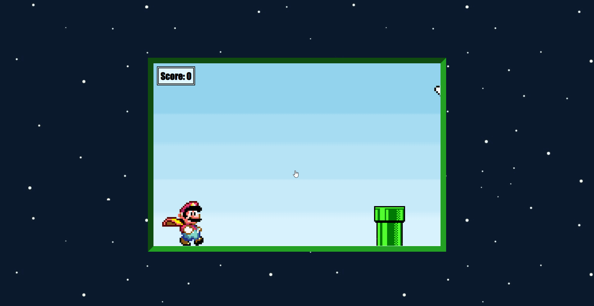

# Jogo JS 

Projeto construído com base no projeto [desse vídeo](https://youtu.be/r9buAwVBDhA) com o intuito de desenvolver um jogo simples, bonito e funcional.

[:globe_with_meridians: Clique aqui para acessar](https://pauloeliass.github.io/jogo-js/)

## :desktop_computer: Tecnologias

- HTML
- CSS
- Javascript
- Git e Github

